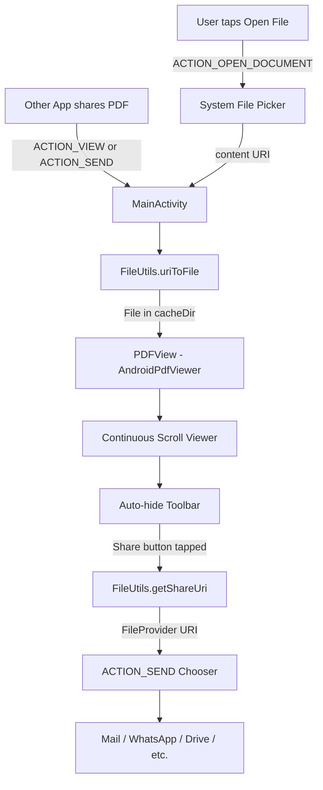

# JustPdf — Android Native PDF Viewer

## Project Summary

A private-use, sideloaded Android app whose sole purpose is to be the default PDF viewer on the device and to share opened PDF files with other apps (mail, WhatsApp, Drive, etc.). No Play Store distribution. Designed for minimum weight, minimum maintenance, and a robust tech stack.

---

## Interview Decisions

| Question | Decision |
|---|---|
| Min SDK | 21 (Android 5.0 Lollipop) |
| File entry points | Receive shared PDFs AND browse file system |
| Persistence | None — fully stateless |
| Language | Kotlin |
| Page navigation | Continuous vertical scroll |
| UI chrome | Minimal auto-hiding toolbar: share button + page counter |

---

## Tech Stack Rationale

### Language: Kotlin
Google's officially recommended language for Android. Better null safety, coroutines for async work, less boilerplate than Java. Ideal for a low-maintenance codebase.

### PDF Rendering: PdfiumAndroid (via AndroidPdfViewer)
The built-in `android.graphics.pdf.PdfRenderer` (API 21+) is functional but has known limitations: no text selection, no link handling, and poor performance on large documents. For a robust viewer the best lightweight option is:

**[AndroidPdfViewer](https://github.com/barteksc/AndroidPdfViewer)** — a well-established open-source library wrapping the Pdfium engine (the same engine used in Chrome). It provides:
- Continuous vertical scroll out of the box
- Pinch-to-zoom and double-tap zoom
- Smooth page rendering with background threading
- Portrait and landscape support
- No network permissions required
- Single Gradle dependency

> **Alternative considered:** [PdfiumAndroid](https://github.com/barteksc/PdfiumAndroid) directly — lower level, more control, but requires more boilerplate. Not worth it for this use case.
> **Alternative considered:** Google's [PDF.js via WebView](https://mozilla.github.io/pdf.js/) — heavier, requires assets bundled, slower. Rejected.

### UI Toolkit: View system (XML layouts) — NOT Jetpack Compose
Compose adds complexity and a larger APK for a single-screen app. The View system is mature, stable, and perfectly suited here. AndroidPdfViewer's `PDFView` is a `View` subclass — it integrates naturally.

### Architecture: Single Activity, no Fragments
The app has exactly one screen. A single `Activity` with no Fragment overhead is the simplest, most maintainable structure. No ViewModel needed (stateless). No Navigation component needed.

### Build: Gradle (Kotlin DSL)
Standard Android build system. Kotlin DSL (`build.gradle.kts`) is preferred over Groovy for type safety and IDE support.

---

## Project Structure

```
JustPdf/
├── app/
│   ├── src/
│   │   └── main/
│   │       ├── java/com/justpdf/
│   │       │   ├── MainActivity.kt          # Single activity: viewer + toolbar
│   │       │   └── FileUtils.kt             # URI → File resolution helpers
│   │       ├── res/
│   │       │   ├── layout/
│   │       │   │   └── activity_main.xml    # PDFView + toolbar overlay
│   │       │   ├── menu/
│   │       │   │   └── menu_viewer.xml      # Share menu item
│   │       │   ├── drawable/                # Vector icons (share, open)
│   │       │   └── values/
│   │       │       ├── strings.xml
│   │       │       ├── colors.xml
│   │       │       └── themes.xml           # Minimal theme, no action bar
│   │       └── AndroidManifest.xml
│   ├── build.gradle.kts
│   └── proguard-rules.pro
├── build.gradle.kts
├── settings.gradle.kts
└── gradle/
    └── libs.versions.toml                   # Version catalog
```

---

## AndroidManifest Design

### Intent Filters (receive PDFs)
```xml
<!-- Opened by file manager / browser tapping a .pdf file -->
<intent-filter>
    <action android:name="android.intent.action.VIEW" />
    <category android:name="android.intent.category.DEFAULT" />
    <data android:mimeType="application/pdf" />
</intent-filter>

<!-- Shared to this app from another app -->
<intent-filter>
    <action android:name="android.intent.action.SEND" />
    <category android:name="android.intent.category.DEFAULT" />
    <data android:mimeType="application/pdf" />
</intent-filter>
```

### Permissions
```xml
<!-- Required for file picker on API 21-32 -->
<uses-permission android:name="android.permission.READ_EXTERNAL_STORAGE"
    android:maxSdkVersion="32" />

<!-- Required for file picker on API 33+ -->
<uses-permission android:name="android.permission.READ_MEDIA_IMAGES" />
<!-- Note: PDFs fall under READ_EXTERNAL_STORAGE on API 33 too;
     use ACTION_OPEN_DOCUMENT (Storage Access Framework) to avoid needing
     broad storage permission at all — preferred approach. -->
```

> **Key decision:** Use the **Storage Access Framework** (`ACTION_OPEN_DOCUMENT`) for the file picker. This requires no storage permission at all — the system picker grants temporary URI access. This is the modern, future-proof approach and works on all API levels ≥ 19.

### FileProvider (for share-out)
To share the opened PDF with other apps, the file URI must be wrapped in a `FileProvider` content URI. This is required since Android 7.0 (API 24).

```xml
<provider
    android:name="androidx.core.content.FileProvider"
    android:authorities="${applicationId}.fileprovider"
    android:exported="false"
    android:grantUriPermissions="true">
    <meta-data
        android:name="android.support.FILE_PROVIDER_PATHS"
        android:resource="@xml/file_paths" />
</provider>
```

---

## Activity Architecture

```
MainActivity
├── onCreate()
│   ├── Resolve incoming URI (from Intent or null)
│   ├── If URI present → loadPdf(uri)
│   └── If no URI → launch file picker
│
├── loadPdf(uri: Uri)
│   ├── Copy content:// URI to cache file if needed (FileUtils)
│   └── pdfView.fromFile(file).load()
│
├── onActivityResult() / ActivityResultLauncher
│   └── Handle file picker result → loadPdf(uri)
│
├── Toolbar auto-hide logic
│   ├── Show on tap
│   └── Auto-hide after 3 seconds of inactivity
│
└── Share action
    ├── Wrap current file as FileProvider URI
    └── Launch ACTION_SEND chooser
```

---

## File Access Strategy

### Path 1 — Incoming shared/viewed file
- `intent.action == ACTION_VIEW` → `intent.data` is the URI
- `intent.action == ACTION_SEND` → `intent.getParcelableExtra(Intent.EXTRA_STREAM)` is the URI
- URI may be a `content://` URI (from another app's FileProvider) or a `file://` URI
- If `content://`: copy to `cacheDir` using `ContentResolver.openInputStream()` → temp file
- If `file://`: use directly (only possible on API < 24 from legacy apps)

### Path 2 — File picker (browse file system)
- Launch `Intent(Intent.ACTION_OPEN_DOCUMENT)` with `type = "application/pdf"`
- Result is a `content://` URI with granted read permission
- Same copy-to-cache strategy as above

### FileUtils.kt responsibilities
- `uriToFile(context, uri): File` — resolves any URI type to a usable `File` in cache
- `getShareUri(context, file): Uri` — wraps a `File` in a `FileProvider` URI for sharing

---

## PDF Viewer UI

### Layout: `activity_main.xml`
```
FrameLayout (root, full screen)
├── PDFView (fill parent)          ← AndroidPdfViewer view
└── ConstraintLayout (toolbar overlay, bottom)
    ├── ImageButton (share)        ← left side
    └── TextView (page counter)    ← right side, e.g. "3 / 12"
```

### PDFView configuration
```kotlin
pdfView.fromFile(file)
    .enableSwipe(true)          // vertical scroll
    .swipeHorizontal(false)
    .enableDoubletap(true)
    .defaultPage(0)
    .onPageChange { page, pageCount -> updatePageCounter(page, pageCount) }
    .onTap { showToolbar(); true }
    .enableAntialiasing(true)
    .spacing(8)                 // dp gap between pages
    .load()
```

### Zoom
- Pinch-to-zoom: handled natively by AndroidPdfViewer
- Double-tap to zoom: enabled via `enableDoubletap(true)`
- Min zoom: fit-width; Max zoom: 4× (configurable)

### Rotation handling
- `android:configChanges="orientation|screenSize"` in manifest — Activity handles rotation itself
- On rotation: PDFView re-renders at new dimensions automatically; page position is preserved by AndroidPdfViewer's internal state
- No need to save/restore page number (stateless design)

---

## Toolbar Behaviour

- **Visibility:** `VISIBLE` on launch, auto-hides after **3 seconds** using a `Handler.postDelayed()`
- **Show trigger:** single tap anywhere on the PDF (via `onTap` callback)
- **Animation:** `fade out` via `View.animate().alpha(0f)` — smooth, lightweight
- **Share button:** always the primary action
- **Page counter:** `"$currentPage / $totalPages"` — updates on scroll via `onPageChange`
- **Background:** semi-transparent dark pill/bar so it's readable over any PDF content

---

## Share-Out Flow

```
User taps Share
    ↓
currentFile (File in cacheDir or original path)
    ↓
FileUtils.getShareUri(context, currentFile)
    → FileProvider.getUriForFile(context, authority, file)
    ↓
Intent(Intent.ACTION_SEND).apply {
    type = "application/pdf"
    putExtra(Intent.EXTRA_STREAM, shareUri)
    addFlags(Intent.FLAG_GRANT_READ_URI_PERMISSION)
}
    ↓
startActivity(Intent.createChooser(intent, "Share PDF via"))
    ↓
System chooser: Mail, WhatsApp, Drive, etc.
```

---

## Gradle Dependencies

```kotlin
// build.gradle.kts (app)
dependencies {
    implementation("com.github.barteksc:android-pdf-viewer:3.2.0-beta.1")
    implementation("androidx.core:core-ktx:1.13.1")
    implementation("androidx.appcompat:appcompat:1.7.0")
    // No Room, no ViewModel, no Compose, no Hilt
}
```

> **Note on AndroidPdfViewer version:** 3.x is the last maintained version. The library is stable and widely used. Since this is a private app with no Play Store review, using a beta is acceptable. If maintenance becomes a concern, the fallback is to use `android.graphics.pdf.PdfRenderer` directly (more code, less features).

---

## Build & Sideload Strategy

### Debug build (simplest path)
```bash
./gradlew assembleDebug
# Output: app/build/outputs/apk/debug/app-debug.apk
```
Transfer to device via USB, ADB, or file share and install directly.

### Release build (recommended for daily use)
- Sign with a local keystore (not Play Store signing)
- `./gradlew assembleRelease`
- Enables ProGuard/R8 minification → smaller APK
- Keystore stored locally, never uploaded anywhere

### Enable sideloading on device
- Settings → Security → Install unknown apps → allow for the file manager / ADB

### ADB install
```bash
adb install app/build/outputs/apk/release/app-release.apk
```

### Set as default PDF viewer
- First time a PDF is opened, Android will prompt "Open with" → select JustPdf → "Always"
- Or: Settings → Apps → Default apps → set manually

---

## Architecture Diagram



---

## What is Deliberately Excluded

| Feature | Reason excluded |
|---|---|
| Bookmarks / history | Stateless by design |
| Text search | Adds complexity; not requested |
| Annotations | Out of scope |
| Password-protected PDFs | Can add later if needed; not in scope |
| Dark mode / night mode | Not requested; reduces scope |
| Multiple tabs | Single document at a time |
| Jetpack Compose | Overkill for one screen |
| ViewModel / LiveData | No state to manage |
| Room / SQLite | No persistence |
| Network permissions | No network access needed |

---

## Risk & Mitigation

| Risk | Mitigation |
|---|---|
| AndroidPdfViewer unmaintained | Library is stable; fallback to native PdfRenderer if needed |
| Large PDF performance | AndroidPdfViewer renders pages lazily; acceptable for private use |
| content:// URI permissions lost after process death | Copy to cacheDir on open; cache is always accessible |
| API 33+ storage permission changes | Using SAF ACTION_OPEN_DOCUMENT avoids permission entirely |
| FileProvider misconfiguration causes share crash | Covered by file_paths.xml and correct authority string |

---

## Implementation Order (for Code mode)

1. Create Android project in `/Users/MichielBrand/Code/Misc/JustPdf` with package `com.justpdf`
2. Configure `build.gradle.kts` with correct minSdk, dependencies, signing
3. Write `AndroidManifest.xml` with intent filters, FileProvider, config changes
4. Write `activity_main.xml` layout (PDFView + toolbar overlay)
5. Write `FileUtils.kt` (URI resolution + FileProvider share URI)
6. Write `MainActivity.kt` (intent handling, file picker, PDF load, toolbar, share)
7. Write `res/xml/file_paths.xml` for FileProvider
8. Build debug APK and verify sideload
